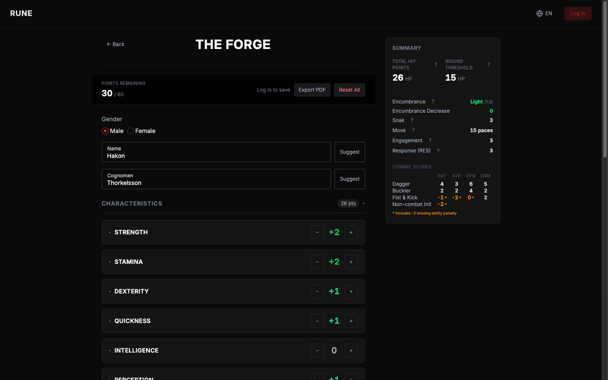

# Rune

A character builder for *Rune*, the Viking tabletop RPG of the same name. Spend your creation points, pick your gear, and watch every derived score — hit points, encumbrance, initiative, attack, defense, damage — recompute as you go. Then export the sheet to PDF, or save it to an account.

**Live: [rune-fobb.onrender.com](https://rune-fobb.onrender.com/)**



I built it for my own table, because filling a *Rune* sheet by hand means walking a dozen cross-referenced tables for every weapon you pick up.

## What it does

- Spend 60 creation points across eight characteristics, learned abilities and extra hit points — with refunds when you lower a rank below zero
- Equip up to three weapons, a shield and armor, and see the encumbrance penalty land on your scores
- Every combat score is computed **per weapon**, missing-ability penalties included
- Export a character sheet to PDF
- English and French
- Optional account (email/password or Google) to save characters — the builder itself needs no login

## Stack

| | |
| --- | --- |
| **App** | React Router 7 (SSR, framework mode), React 19, TypeScript, HeroUI, Tailwind CSS 4, i18next |
| **Data** | Supabase — Auth (email/password + Google OAuth) and Postgres, with row-level security as the authorization boundary and the schema under versioned migration |
| **Tests** | Vitest + Testing Library — 265 tests, nearly all against the pure rules layer |
| **CI/CD** | CircleCI: lint, typecheck, test and build run in parallel; `main` deploys to Render via a deploy hook |
| **Runtime** | Docker on Render |

## How it was built

I didn't write the implementation. I specced it, reviewed it, and corrected it — coding agents did the typing, and I stayed the architect and the reviewer.

Roughly **15–20 hours of actual work**, spread over several sessions, for something that is live in production with authentication, CI/CD and a versioned database. Supabase was a tool I had never used before this project; I picked it up during the build (Postgres and SQL were not new).

The interesting part is the loop, not the output — [**docs/HOW_THIS_WAS_BUILT.md**](docs/HOW_THIS_WAS_BUILT.md) covers the workflow, the design decisions behind the domain layer and the persistence model, and two bugs an agent wrote that looked perfectly correct.

## How I work with agents

Everything an agent needs to work on this repo unsupervised is committed:

| File | What it holds |
| --- | --- |
| [`CLAUDE.md`](CLAUDE.md) | Project conventions: the layered architecture, the design system rule, the verification commands to run after any change |
| [`CONTEXT.md`](CONTEXT.md) | The domain glossary — the rulebook's vocabulary, so agents name things the way the game does instead of inventing synonyms |
| [`.claude/skills/`](.claude/skills/) | Ten skills encoding the workflow itself: `planner` → `plan-reviewer` → `plan-executor` → `verify`, plus review lenses (`code-design`, `testing`, `security-review`, `frontend-architecture`, `i18n`, `ux-expert`) |
| [`.claude/plans/`](.claude/plans/) | The actual specs, kept as written: codebase findings, then a phased plan, then progress. `auth-persistence/` is the largest feature in the repo, planned before a line of it was written |
| [`.claude/settings.json`](.claude/settings.json) | Guardrails as hooks: ESLint auto-fixes every file an agent writes, and any write to `.env`/`.pem`/`.key` is blocked outright |
| [`.claude/memory/`](.claude/memory/) | Decisions worth surviving a session — theme, global UI choices |
| [`.mcp.json`](.mcp.json) | MCP servers: **context7** for current library docs (React Router 7 and HeroUI move faster than any model's training data), **playwright** to drive the real app, **github** for repo operations |

## Development

```sh
npm install
cp .env.example .env   # fill in your Supabase project URL and anon key
npm run dev
```

| Command | Description |
| --- | --- |
| `npm run dev` | Start development server |
| `npm run build` | Production build |
| `npm run start` | Serve production build |
| `npm run lint` | Run ESLint |
| `npm run typecheck` | Run TypeScript type checking |
| `npm test` | Run tests |

```sh
docker build -t rune .
docker run -p 3000:3000 rune
```

---

Unofficial fan tool. Not affiliated with or endorsed by the publisher of *Rune*; all rules content belongs to its rights holders.
